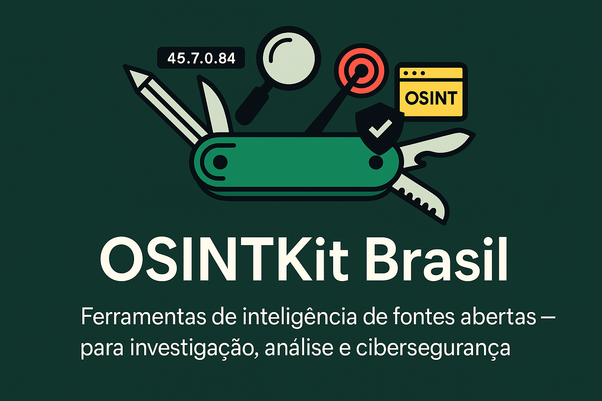

# 🧰 OSINTKit Brasil

**OSINTKit Brasil** é uma curadoria nacional de ferramentas de OSINT (Open Source Intelligence), cuidadosamente organizadas para facilitar investigações, pesquisas e atividades de segurança da informação. O projeto reúne mais de **1600 links** úteis categorizados em formato de **bookmarks HTML compatíveis com qualquer navegador**.

Inspirado por iniciativas internacionais e nacionais, o OSINTKit Brasil visa oferecer um ponto de partida confiável, prático e acessível para analistas, investigadores e entusiastas da ciberinteligência no Brasil.

---

## 🌐 Como importar os bookmarks

Você pode importar o arquivo `osintkit_brasil.html` diretamente para seu navegador (Chrome, Firefox, Edge, Brave, etc). Veja como:

### 🔹 Google Chrome ou Brave

1. Acesse `chrome://bookmarks/`
2. Clique no menu de três pontos (⋮)
3. Escolha **Importar favoritos**
4. Selecione o arquivo `osintkit_brasil.html`

### 🔹 Mozilla Firefox

1. Pressione `Ctrl + Shift + B` para abrir a Biblioteca de Favoritos
2. Clique em **Importar e Backup** (canto superior)
3. Selecione **Importar favoritos do HTML...**
4. Escolha o arquivo `osintkit_brasil.html`

### 🔹 Microsoft Edge

1. Vá para `edge://favorites/`
2. Clique no menu de três pontos (⋮)
3. Selecione **Importar favoritos**
4. Escolha a opção de arquivo HTML

---

## 🗂️ Estrutura das categorias

Os links estão organizados por **categorias temáticas** e, quando necessário, por **subcategorias**, de modo a facilitar a navegação sem sobrecarregar o usuário. Alguns exemplos:

- **Pessoas** → OSINT de redes sociais, usernames e rostos
- **Geolocalização** → Mapas, imagens de satélite, geofencing
- **Deep Web** → Motores de busca .onion e diretórios
- **Corporate Intelligence** → Empresas, domínios, registros comerciais
- **Forense Digital** → Metadados, hashing, análise de mídia
- **Plataformas e Agregadores** → Kits, hubs e bases de dados OSINT
- **Secundárias** → Fóruns, repositórios abertos, discussões técnicas

---

## 🙌 Créditos e agradecimentos

Este projeto foi possível graças à generosidade de comunidades e iniciativas que compartilharam conhecimento de forma aberta. Nossos mais sinceros agradecimentos a:

- 🔍 **Caipora (Brasil)** – [Curadoria original de ferramentas OSINT no cenário nacional](https://caipora.pro/)
- 🌐 **TraceLabs** – [OSINT Search Party Bookmarks, estrutura refinada e internacional](https://www.tracelabs.org/)
- 🇧🇷 **OSINT Brazuca** – [Coletâneas locais e iniciativas brasileiras em OSINT](https://github.com/osintbrazuca/osint-brazuca)
- 🚀 **OSINT Awesome** – [Listagem internacional de ferramentas OSINT no GitHub](https://github.com/jivoi/awesome-osint)

Este projeto se inspira, adapta e complementa essas fontes com curadoria própria, revisão de duplicatas e tradução de categorias para o português.

---

## 📥 Contribua

Tem um link que merece estar aqui? Encontrou uma ferramenta nova ou brasileira que não consta na lista? Envie um pull request ou abra uma issue!

---

## 📘 Licença

Este projeto está licenciado sob a licença [MIT](LICENSE).

---

**Feito com 🇧🇷 por quem acredita na informação como poder e na colaboração como método.**
